```{r setup, include=FALSE}
knitr::opts_chunk$set(echo = TRUE)
```

# RNA-seq Quality Assessment Report - Bi 623 (Summer 2025 Assignment/PS 2)

### Table 1: Data Set Summary

| Field | Sample 1 | Sample 2 |
|------------------------|------------------------|------------------------|
| **SRA ID** | SRR25630298 | SRR25630380 |
| **Sequencing** | PE, 150 bp RL | PE, 150 bp RL |
| **Size** | 6.0 GB | 3.1 GB |
| **Species** | Campylomormyrus compressirostris x Campylomormyrus rhynchophorus (comrhy) | Campylomormyrus compressirostris x Campylomormyrus rhynchophorus (comrhy) |
| **Tissue** | electric organ (eo) | electric organ (eo) |
| **Sample** | comrhy63 | comrhy112 |
| **Age** | 6cm | adult |
| **BioSample** | [SAMN36981033](https://www.ncbi.nlm.nih.gov/biosample/SAMN36981033 "Link to BioSample") | [SAMN36981991](https://www.ncbi.nlm.nih.gov/biosample/SAMN36981991) |
| **BioProject** | [PRJNA1005245](https://www.ncbi.nlm.nih.gov/bioproject/PRJNA1005245) | [PRJNA1005244](https://www.ncbi.nlm.nih.gov/bioproject/PRJNA1005244) |
| **SRA Link** | [SRR25630298](https://trace.ncbi.nlm.nih.gov/Traces/?view=run_browser&acc=SRR25630298&display=metadata) | [SRR25630380](https://trace.ncbi.nlm.nih.gov/Traces/?view=run_browser&acc=SRR25630380&display=metadata) |

### Commands used to download data from NCBI

```{bash, eval=FALSE}
## Download your data
prefetch SRR25630380
fasterq-dump --split-files SRR25630380/SRR25630380.sra
# spots read      : 32,853,814
# reads read      : 65,707,628
# reads written   : 65,707,628
prefetch SRR25630298
fasterq-dump --split-files SRR25630298/SRR25630298.sra
# spots read      : 64,192,480
# reads read      : 128,384,960
# reads written   : 128,384,960

```

## Part 1 – Read quality score distributions

### Conda environment details:

```{bash, eval=FALSE}
conda create -n QAA
conda activate QAA
conda install cutadapt=5.0
conda install fastqc=0.12.1
conda install trimmomatic=0.39
conda install bioconda::sra-tools
conda install star=2.7.11b
conda install picard=2.18
conda install samtools=1.22.1
conda install numpy=2.3.2
conda install matplotlib=3.10.6
conda install htseq=2.0.9
conda install gffread 
```

### Pre-trimming quality and n-content plots generated with FastQC:

### *SRR25630380_FW:*

 **Figure 1.** Per-base n-content in comrhy_112_EO_adult/3.1GB_SRR25630380_1.fastq.gz. This was confirmed as the foward read library for this sample.

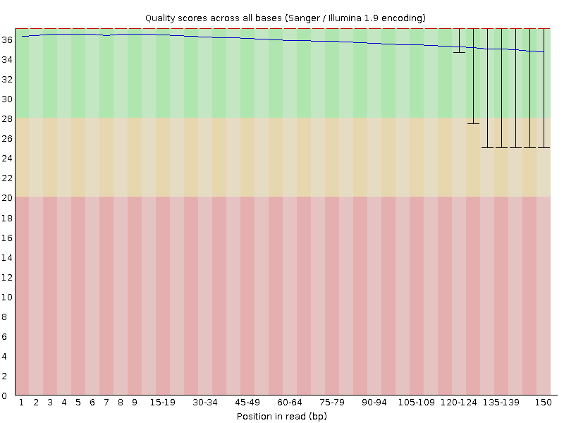 **Figure 2.** Per-base quality in comrhy_112_EO_adult/3.1GB_SRR25630380_1.fastq.gz. This was confirmed as the foward read library for this sample.

### *SRR25630380_RV:*

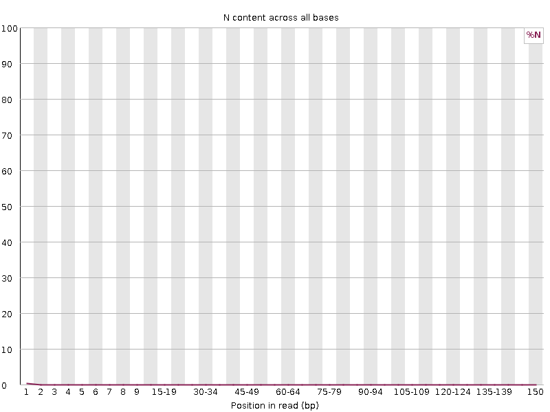 **Figure 3.** Per-base n-content in comrhy_112_EO_adult/3.1GB_SRR25630380_2.fastq.gz. This was confirmed as the reverse read library for this sample.

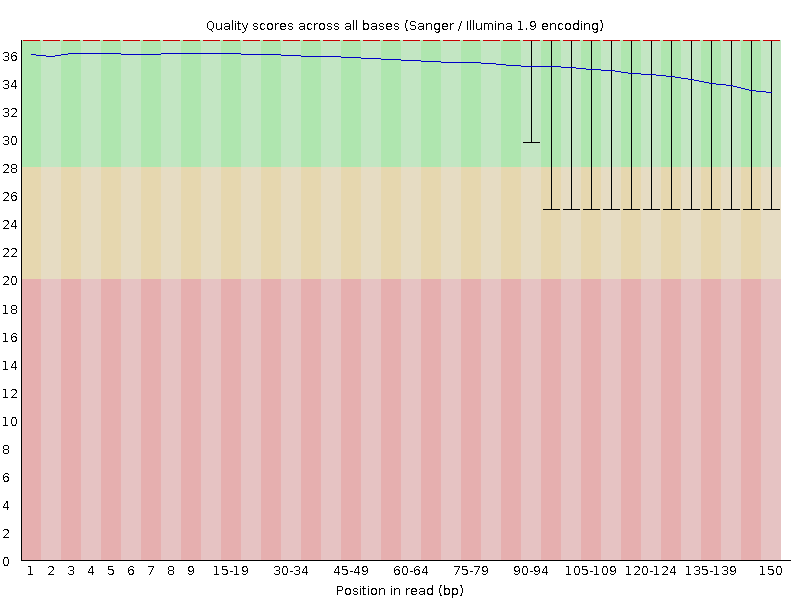 **Figure 4.** Per-base quality in comrhy_112_EO_adult/3.1GB_SRR25630380_2.fastq.gz. This was confirmed as the reverse read library for this sample.

### *SRR25630298_FW:*

 **Figure 5.** Per-base n-content in comrhy_63_EO_6cm/6GB_SRR25630298_1.fastq.gz. This was confirmed as the foward read library for this sample.

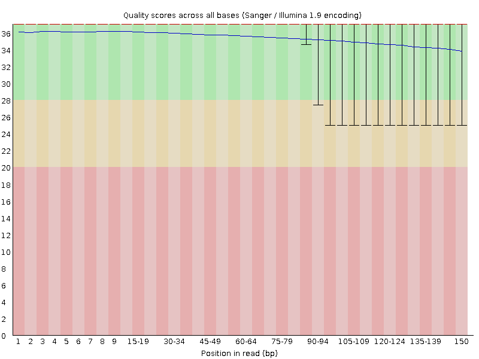 **Figure 6.** Per-base quality in comrhy_63_EO_6cm/6GB_SRR25630298_1.fastq.gz. This was confirmed as the foward read library for this sample.

### *SRR25630298_RV*

 **Figure 7.** Per-base n-content in comrhy_63_EO_6cm/6GB_SRR25630298_2.fastq.gz. This was confirmed as the reverse read library for this sample.

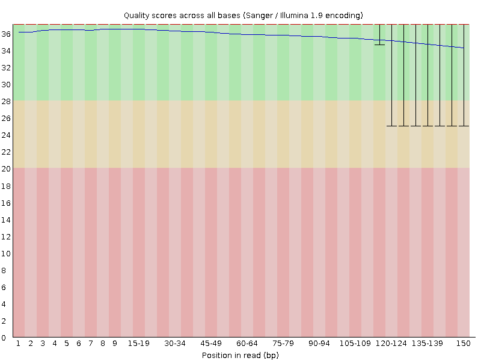 **Figure 8.** Per-base quality in comrhy_63_EO_6cm/6GB_SRR25630298_2.fastq.gz. This was confirmed as the reverse read library for this sample.

### Comments on FASTQC Quality/N Content Graphs:

All files have few to no "N" calls, so decreasing quality towards the end of the reads cannot be attributed to this. Instead, this decreasing quality as position in read increases is simply due to sequencing error as earlier positions in the read are more likely to be synthesized and called correctly.

*Command used to generate FastQC report:*

```{bash, eval=FALSE}
fastqc -t 6 *.fastq.gz
```

### Pre-trimming quality plots generated with my own script:

### SRR25630380_FW:

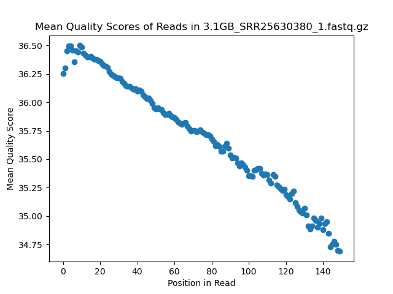 **Figure 9.** Per-base quality of comrhy_112_EO_adult/3.1GB_SRR25630380_1.fastq.gz shown in a scatter plot and generated by my homemade script This was confirmed as the forward read library for this sample.

### SRR25630380_RV:

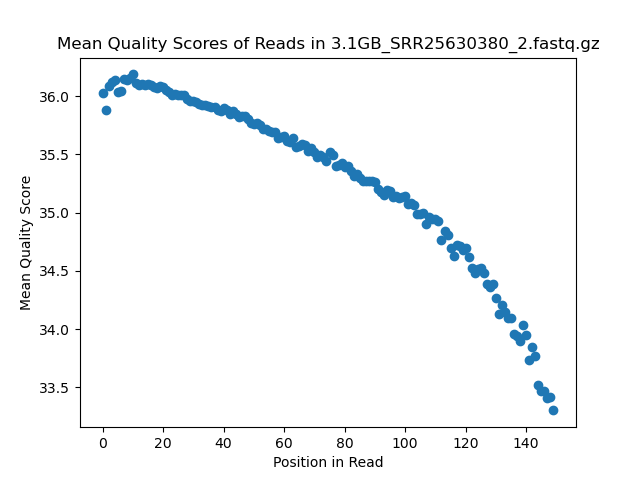 **Figure 10.** Per-base quality of comrhy_112_EO_adult/3.1GB_SRR25630380_2.fastq.gz shown in a scatter plot and generated by my homemade script This was confirmed as the reverse read library for this sample.

### SRR25630298_FW:

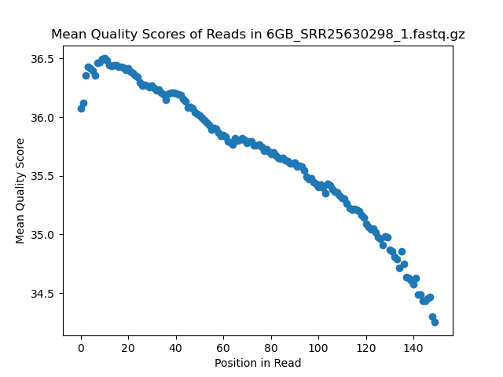 **Figure 11.** Per-base quality of comrhy_63_EO_6cm/6GB_SRR25630298_1.fastq.gz shown in a scatter plot and generated by my homemade script This was confirmed as the forward read library for this sample.

### SRR25630298_RV:

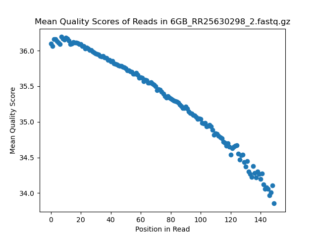 **Figure 12.** Per-base quality of comrhy_63_EO_6cm/6GB_SRR25630298_2.fastq.gz shown in a scatter plot and generated by my homemade script This was confirmed as the reverse read library for this sample.

### Comments on plotting with FastQC vs. my homemade script:

FastQC was MUCH faster than my script to generate just a single per-base quality plot, likely because it is not written in python and is parallelizable. However, FastQC needed a ton of memory due to its huge temporary directory it creates while running; this is overhead that my script doesn't need. FastQC also varied in its CPU usage while running whereas my script basically used 100% of the node it was running on the whole time it was running.

One big difference that I noticed in the actual graphs is that the per-base quality values are slightly different between FastQC and my generated quality plots. This can be attributed to FastQC using medians rather than means for these plots. Also, the plotting of FastQC is more legible than my own plot due to its y-axis scale and coloring.

*Takeaway:* Don't reinvent the wheel. If there's a well-regarded and appropriate tool out there for a given analysis you'd like to complete, use the tool.

### Comments on overall library quality

### Table 2: FastQC Summary

| Sample | File | Per Base Qual | Per Tile Qual | Per Seq Qual | Per Base Seq Prop | Per Seq GC | Per Base N | Seq Len Dist | Seq Dupe Levels | Overrep Seqs | Adapter Content |
|-------------|------|------|------|------|------|------|------|------|------|-------|------|
| SRR25630298 | R1 | Pass | Warn. | Pass | Fail | Pass | Pass | Pass | Fail | Warn. | Pass |
| SRR25630298 | R2 | Pass | Warn. | Pass | Fail | Pass | Pass | Pass | Fail | Warn. | Pass |
| SRR25630380 | R1 | Pass | Pass | Pass | Fail | Pass | Pass | Pass | Fail | Warn. | Warn. |
| SRR25630380 | R2 | Pass | Pass | Pass | Fail | Pass | Pass | Pass | Fail | Warn. | Warn. |

The overall quality of all four sequencing files used for this report is fairly high, however FastQC's quality reports indicated that there are still some things we should do before using these files for further analyses. Namely, all four files, especially those for SRR25630298, should be filtered against adapter sequences because these are not true biological reads. Additionally, FastQC warned that all files have some over-represented sequences with no clear source. While none of these over-represented sequences surpassed 1% overall representation, they are still potential sources of future error which should be investigated and potentially filtered out. The biggest fear with these sequences is that they could be contaminates which are not biologically relevant to our samples and, if not removed, may lead to false conclusions from out data. Finally, FastQC revealed that we have extremely high levels of sequence duplication in our samples which can be attributed to PCR. These duplicates should be removed to prevent PCR-induced bias in our data. Any warnings or fails not already mentioned can be attributed to typical RNA sequencing error, and do not need to be investigated further.

## Part 2 – Adapter trimming comparison

### Table 3: Adapter Trimming Summary Statistics

| SRA ID      | R1 (Forward)  | R2 (Reverse)  | Average       |
|-------------|---------------|---------------|---------------|
| SRR25630380 | 0.148 (14.8%) | 0.148 (14.8%) | 0.148 (14.8%) |
| SRR25630298 | 0.057 (5.7%)  | 0.065 (6.5%)  | 0.061 (6.1%)  |

### Commands used to remove adapters:

```{bash, eval=FALSE}

# ~~~~ Sanity check ~~~~

# Goal: Confirm the identity of foward and reverse reads for correct adapter trimming.

# Strategy: 
# 1. Adapter content graph showed Illumina universal adapters, so I looked up these sequences
# 2. Greped for lines containing these sequences in all files 
# 3. Only the sequence with hits in the file is the true adapter (also indicating FW/RV based on which adapter it is)

zcat 3.1GB_SRR25630380_2.fastq.gz | grep "AGATCGGAAGAGCGTCGTGTAGGGAAAGAGTGT" | head
# Quickly prints 10 lines - R2 = Reverse

zcat 3.1GB_SRR25630380_2.fastq.gz | grep "AGATCGGAAGAGCACACGTCTGAACTCCAGTCA" | head
# Does not print any lines

zcat 3.1GB_SRR25630380_1.fastq.gz | grep "AGATCGGAAGAGCACACGTCTGAACTCCAGTCA" | head
# Quickly prints 10 lines - R1 = Foward

zcat 3.1GB_SRR25630380_1.fastq.gz | grep "AGATCGGAAGAGCGTCGTGTAGGGAAAGAGTGT" | head
 # Does not print any lines
 
zcat 6GB_SRR25630298_1.fastq.gz | grep "AGATCGGAAGAGCACACGTCTGAACTCCAGTCA" | head
# Quickly prints out 10 lines - R1 = Foward 

zcat 6GB_SRR25630298_1.fastq.gz | grep "AGATCGGAAGAGCGTCGTGTAGGGAAAGAGTGT" | head
 # Does not print any lines

zcat 6GB_RR25630298_2.fastq.gz | grep "AGATCGGAAGAGCGTCGTGTAGGGAAAGAGTGT" | head
# Quickly prints 10 lines - R2 = Reverse

zcat 6GB_RR25630298_2.fastq.gz | grep "AGATCGGAAGAGCACACGTCTGAACTCCAGTCA" | head
 # Does not print any lines


# ~~~~ CutAdapt ~~~~

# Goal: Remove adapters from our sequencing files.

# Note - I used 6 cores but changed no other options
cutadapt -a AGATCGGAAGAGCACACGTCTGAACTCCAGTCA -A AGATCGGAAGAGCGTCGTGTAGGGAAAGAGTGT -j 6 -o 6GB_SRR25630298_1_noAdapt.fastq.gz -p 6GB_RR25630298_2_noAdapt.fastq.gz 6GB_SRR25630298_1.fastq.gz 6GB_RR25630298_2.fastq.gz

# Note - I used 6 cores but changed no other options
cutadapt -a AGATCGGAAGAGCACACGTCTGAACTCCAGTCA -A AGATCGGAAGAGCGTCGTGTAGGGAAAGAGTGT -j 6 -o 3.1GB_SRR25630380_1_noAdapt.fastq.gz -p 3.1GB_SRR25630380_2_noAdapt.fastq.gz 3.1GB_SRR25630380_1.fastq.gz 3.1GB_SRR25630380_2.fastq.gz
```

### Commands used to quality trim:

```{bash, eval=FALSE}

# All written into an sbatch script with 6 cpus per task

cd /projects/bgmp/alaberge/bioinfo/Bi623/QAA/data/comrhy_112_EO_adult

trimmomatic PE -threads 6  3.1GB_SRR25630380_1_noAdapt.fastq.gz 3.1GB_SRR25630380_2_noAdapt.fastq.gz -baseout 3.1GB_SRR25630380_noAdapt.fastq.gz LEADING:3 TRAILING:3 SLIDINGWINDOW:5:15 MINLEN:35 

cd /projects/bgmp/alaberge/bioinfo/Bi623/QAA/data/comrhy_63_EO_6cm

trimmomatic PE -threads 6 6GB_SRR25630298_1_noAdapt.fastq.gz 6GB_RR25630298_2_noAdapt.fastq.gz -baseout 6GB_SRR25630298_noAdapt.fastq.gz LEADING:3 TRAILING:3 SLIDINGWINDOW:5:15 MINLEN:35
```

8.  Plot the trimmed read length distributions for both paired R1 and paired R2 reads (on the same plot - yes, you will have to use Python or R to plot this. See ICA4 from Bi621). You can produce 2 different plots for your 2 different RNA-seq samples. There are a number of ways you could possibly do this. One useful thing your plot should show, for example, is whether R1s are trimmed more extensively than R2s, or vice versa. Comment on whether you expect R1s and R2s to be adapter-trimmed at different rates and why.

### SRR25630380

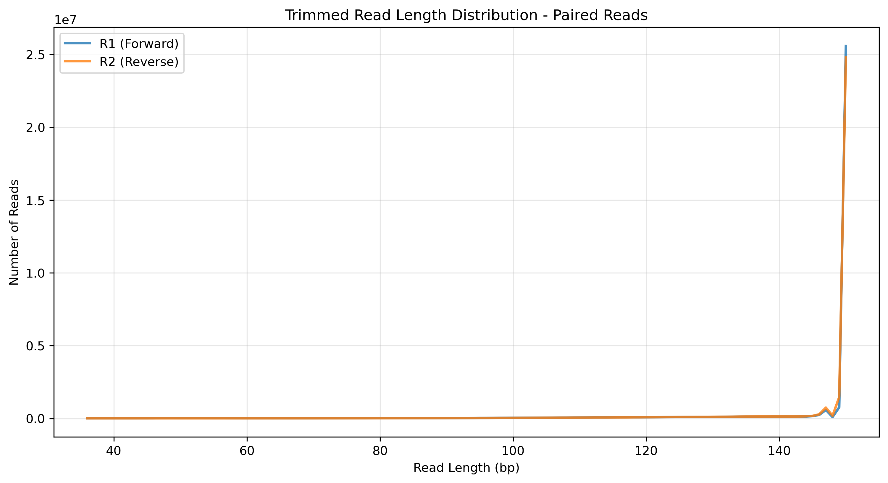 **Figure 13.** Read length distribution of forward and reverse reads following adapter and quality trimming for comrhy_112_EO_adult/3.1GB_SRR25630380. Trimming was consistent between both paired files.

### SRR25630298

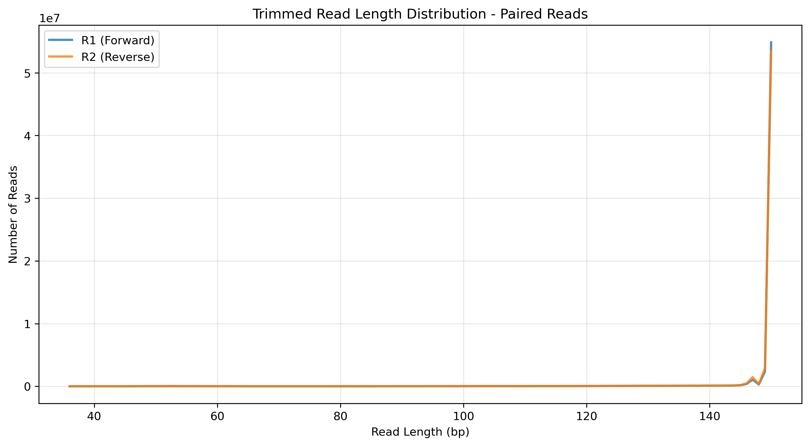 **Figure 13.** Read length distribution of forward and reverse reads following adapter and quality trimming for comrhy_63_EO_6cm/6GB_SRR25630298. Trimming was consistent between both paired files.

### Comments on adapter trimming:

To do this plotting, I created two scripts: plotReadLenDist.py runPlotReadLenDist.sh

These plots show, most importantly, that our adapter trimming has worked because we have no measurable adapter-sized sequences in our libraries. For both libraries, the read length distribution of both forward and reverse reads is nearly equivalent. This indicates that trimming was relative symmetric between paired reads, as expected. We expect that adapter content in paired reads will be very similar because of the close physical proximity of both strands during library preparation (i.e. if insert size is off on the forward read, it is likely to be off on the reverse as well), meaning that adapter-related sequencing errors (specifically read-through) tend to occur concurrently on paired strands.

## Part 3 – Alignment and strand-specificity

### Alignment Details

I was unable to download the genome using wget or curl due to anti-AI agent scraping software, so I copied the following files from talapas to my data directory:

1.  /projects/bgmp/shared/Bi623/PS2/campylomormyrus.fasta

2.  /projects/bgmp/shared/Bi623/PS2/campylomormyrus.gff

I converted the gff to a gtf using gffread: `gffread -T campylomormyrus.gff -o campylomormyrus.gtf`

All alignment (STAR) commands are contained in [alignToRef.sh](alignToRef.sh) in my github repo.

### Deduplication Details

#### Commands used to sort SAMs and run picard:

```{bash, eval=FALSE}
samtools sort -o cco_SRR25630380_trim_align_sort.bam cco_SRR25630380_trimmedAligned.out.sam 

samtools sort -o cco_SRR25630298_trim_align_sort.bam cco_SRR25630298_trimmedAligned.out.sam

picard MarkDuplicates INPUT=/projects/bgmp/alaberge/bioinfo/Bi623/QAA/data/comrhy_112_EO_adult/cco_SRR25630380_trim_align_sort.bam \
    OUTPUT=/projects/bgmp/alaberge/bioinfo/Bi623/QAA/data/comrhy_112_EO_adult/picard_out/SRR25630380_marked_dups.bam \
    METRICS_FILE=SRR25630380_marked_dups_metrics.txt REMOVE_DUPLICATES=TRUE \
    VALIDATION_STRINGENCY=LENIENT

picard MarkDuplicates INPUT=/projects/bgmp/alaberge/bioinfo/Bi623/QAA/data/comrhy_63_EO_6cm/STAR_out/cco_SRR25630298_trim_align_sort.bam \
    OUTPUT=/projects/bgmp/alaberge/bioinfo/Bi623/QAA/data/comrhy_112_EO_adult/picard_out/SRR25630298_marked_dups.bam \
    METRICS_FILE=SRR25630298_marked_dups_metrics.txt REMOVE_DUPLICATES=TRUE \
    VALIDATION_STRINGENCY=LENIENT
```

***NOTE*** : My picard commands did not work. Hope and I attempted to debug it to no avail, so Hope told me to skip Picard. Therefore, these mapped/unmapped stats were done on STAR's outputted aligned SAMs. Additionally, the htseq-count runs were done with these files as well.

### Table 4: Mapped vs. Unmapped Reads Following Alignment

| Sample | File | Mapped Reads | Unmapped Reads | Total Reads | Mapping Rate (%) |
|------------|------------|------------|------------|------------|------------|
| comrhy_63_EO_6cm | cco_SRR25630298_trimmedAligned.out.sam | 120,654,833 | 6,202,807 | 126,857,640 | 95.1% |
| comrhy_112_EO_adult | cco_SRR25630380_trimmedAligned.out.sam | 61,373,166 | 3,548,680 | 64,921,846 | 94.5% |

#### Commands used to get gene counts with htseq-count:

```{bash, eval=FALSE}
htseq-count --stranded=yes /projects/bgmp/alaberge/bioinfo/Bi623/QAA/data/comrhy_63_EO_6cm/STAR_out/cco_SRR25630298_trimmedAligned.out.sam \
    /projects/bgmp/alaberge/bioinfo/Bi623/QAA/data/refGenome/campylomormyrus.gtf \
    > /projects/bgmp/alaberge/bioinfo/Bi623/QAA/data/comrhy_63_EO_6cm/STAR_out/cco_SRR25630298_trimmedAligned.counts.foward.tsv

htseq-count --stranded=reverse /projects/bgmp/alaberge/bioinfo/Bi623/QAA/data/comrhy_63_EO_6cm/STAR_out/cco_SRR25630298_trimmedAligned.out.sam \
    /projects/bgmp/alaberge/bioinfo/Bi623/QAA/data/refGenome/campylomormyrus.gtf \
    > /projects/bgmp/alaberge/bioinfo/Bi623/QAA/data/comrhy_63_EO_6cm/STAR_out/cco_SRR25630298_trimmedAligned.counts.reverse.tsv

htseq-count --stranded=yes /projects/bgmp/alaberge/bioinfo/Bi623/QAA/data/comrhy_112_EO_adult/cco_SRR25630380_trimmedAligned.out.sam \
    /projects/bgmp/alaberge/bioinfo/Bi623/QAA/data/refGenome/campylomormyrus.gtf \
    > /projects/bgmp/alaberge/bioinfo/Bi623/QAA/data/comrhy_112_EO_adult/cco_SRR25630380_trimmedAligned.counts.foward.tsv

htseq-count --stranded=reverse /projects/bgmp/alaberge/bioinfo/Bi623/QAA/data/comrhy_112_EO_adult/cco_SRR25630380_trimmedAligned.out.sam \
    /projects/bgmp/alaberge/bioinfo/Bi623/QAA/data/refGenome/campylomormyrus.gtf \
    > /projects/bgmp/alaberge/bioinfo/Bi623/QAA/data/comrhy_112_EO_adult/cco_SRR25630380_trimmedAligned.counts.reverse.tsv
```

#### These are strand-specific libraries:

In order to determine if these reads are strand-specific, I wrote a basic [bash script](strandednessAnalysis.sh) to determine how many genes were identified in each htseq-count run. This script outputted the following:

```         
comrhy_63_EO_6cm
Forward: 1855968
Reverse: 35218698
comrhy_112_EO_adult
Forward: 870573
Reverse: 16070746
```

Using these numbers, I determined that the ratio between forward and reverse gene counts for comrhy_63_EO_6cm is roughly 19:1 indicating that this is a strand-specific library and the reverse counts should be used for further analysis. Additionally, I determined this same ratio for comrhy_112_EO_adult to be roughly 18.5:1 indicating that this is also a strand-specific library. Reverse counts should be used for comrhy_112_EO_adult as well.
